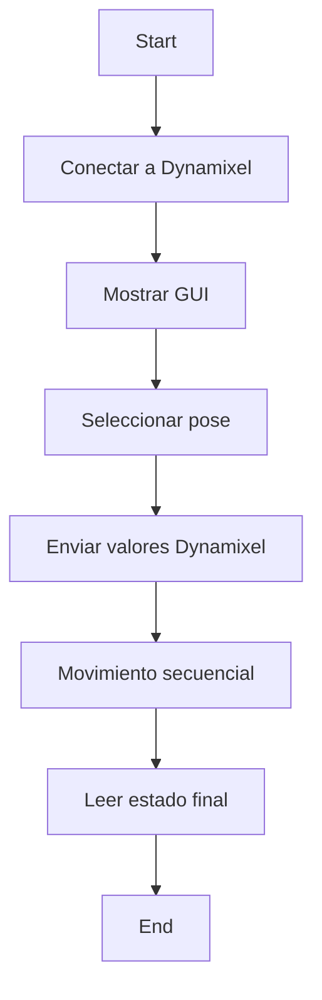

# 🔪 Laboratorio No. 4: Cinemática Directa del Phantom X con ROS 2

## 🤖 Robot Manipulador: Phantom X Pincher

## 👥 Integrantes

* Juan Manuel Rojas Luna
* Miguel Ángel Ortiz Mejía
* Dixon Alberto Cuesta Segura

---

## 📌 Introducción

Este laboratorio tiene como propósito aplicar los conceptos de **cinemática directa** en un entorno práctico utilizando el robot Phantom X Pincher. Mediante el uso de **ROS 2**, **Python** y los servomotores **Dynamixel AX-12**, se busca comprender cómo los modelos matemáticos se relacionan con el movimiento físico del robot.

Se desarrolló una interfaz gráfica (HMI) con Python para enviar poses predefinidas al robot, visualizar en tiempo real la posición de cada articulación y validar los resultados con los cálculos de la matriz de transformación homogénea (MTH) obtenida con el modelo DH modificado.

---

## ❓ Planteamiento del Problema

Se busca:

* Medir físicamente el robot para extraer sus parámetros geométricos.
* Implementar los Joint Controllers en ROS 2.
* Controlar secuencialmente cada articulación.
* Validar el modelo matemático con el comportamiento real del robot.

---

## 🎯 Objetivos del Laboratorio

* ✅ Crear controladores articulares con ROS 2 para los motores Dynamixel AX-12.
* ✅ Manipular tópicos y servicios para cada articulación.
* ✅ Conectar el robot Phantom X Pincher con Python usando ROS 2.
* ✅ Crear una interfaz gráfica (GUI) funcional.
* ✅ Graficar la configuración en el toolbox y comparar con el robot físico.

---

## 🛠️ Requisitos

* Ubuntu 22.04 LTS
* ROS 2 Humble + `colcon build`
* [Dynamixel Workbench](https://github.com/labsir-un/ROB_Intro_ROS2_Humble_Phantom_Pincher_X100.git)
* Python 3
* Paquete Phantom X Pincher
* Phantom X con base de madera

---

## 🖐️ Cinemática Directa del Phantom X

Se utilizó el modelo **Denavit-Hartenberg modificado (DHmod)** para definir los parámetros cinemáticos del manipulador.

### 🖼️ Parámetros DH Modificado

> *\[Aquí insertar imagen clara de la tabla DH con longitudes reales medidas]*

---

### 🖼️ Matriz de Transformación Homogénea Final

> *\[Aquí insertar imagen escaneada o escrita de la MTH final obtenida manualmente]*
> Esta matriz representa la transformación desde la base hasta el efector final del robot.

---

## 💻 Implementación en Python y ROS 2

El script `control_servo.py` implementa una interfaz gráfica para enviar configuraciones articulares al robot, leer el estado actual y visualizarlo en tiempo real.

### ⚙️ Funcionalidades de la GUI

* Conexión vía puerto serial al motor.
* Ejecución secuencial de las poses.
* Carga de imágenes de cada configuración.
* Lectura y visualización de ángulos actuales.
* Conversión entre grados y valores Dynamixel.

### 📦 Poses predefinidas utilizadas

| Configuración | q1  | q2  | q3  | q4  | q5 |
| ------------- | --- | --- | --- | --- | -- |
| Home          | 0   | 0   | 0   | 0   | 0  |
| Config 1      | 25  | 25  | 20  | -20 | 0  |
| Config 2      | -35 | 35  | -30 | 30  | 0  |
| Config 3      | 85  | -20 | 55  | 25  | 0  |
| Config 4      | 80  | -35 | 55  | -45 | 0  |

---

## ✅ Resultados y Validación

> *\[Insertar aquí capturas de pantalla de la GUI en uso, salidas del terminal y fotografías del robot ejecutando las poses]*

> *Comparar la configuración gráfica generada por toolbox con las fotos del robot real.*

---

## 🖥️ Interfaz Gráfica (HMI)

> *\[Insertar aquí captura de la GUI]*
> La interfaz permite seleccionar poses, observar valores actuales de las articulaciones, y ver las imágenes asociadas a cada configuración.

---

## 📄 Instrucciones de Uso

### 1. Ejecutar la GUI

```bash
python3 control_servo.py
```

### 2. Configuración previa

* Conectar el robot vía USB.
* Verificar que el puerto sea correcto (`/dev/ttyUSB0`).
* Tener los motores conectados y alimentados.

---
## Videos.

Se adjunta el video correspondiente del brazo alcanzando cada posición solicitada y simultaneamente la demostracipón de uso de la interfaz de usuario.

[Video](https://youtu.be/Ski5qsBnYsE)

---
## 📚 Conclusiones

> *\[Incluir aquí aprendizajes clave: relación teoría-práctica, utilidad de ROS 2, validación con el robot, importancia del modelado y la calibración.]*

---

## 📌 Anexos

* Diagrama de flujo en Mermaid:



* Archivos relevantes:

  * `control_servo.py`
  * Imagen de la tabla DH
  * Imagen MTH final
  * Fotos de cada configuración del robot

---

## 🧠 Recomendaciones

* Validar siempre los límites articulares antes de ejecutar una pose.
* Evitar obstáculos físicos en el workspace.
* Grabar cada pose para comparar contra el modelo gráfico.

---

## 📌 Referencias

* Craig, J. J. (2005). *Introduction to Robotics: Mechanics and Control.*
* [Documentación Dynamixel + ROS](https://emanual.robotis.com/docs/en/software/dynamixel/dynamixel_workbench/#ros-tutorials)
* Laboratorio Robótica Industrial – 2025-I


